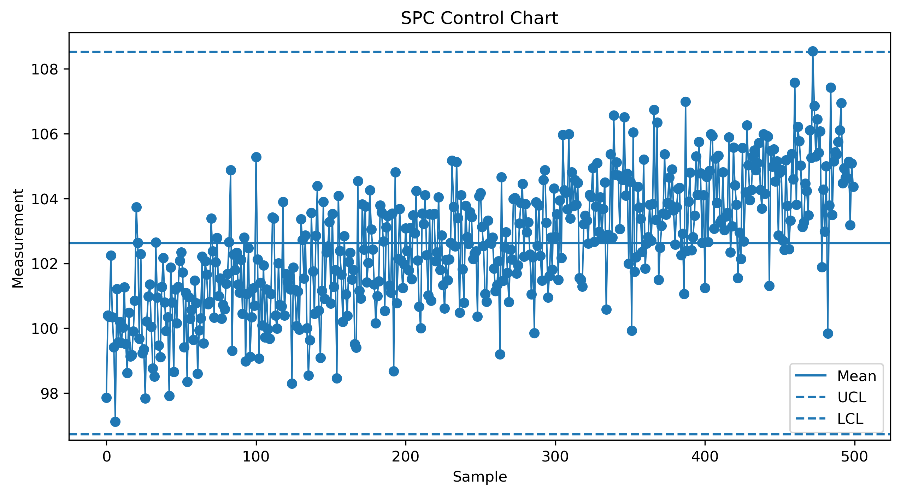

# SPC Process Control Analysis (Python)

This project simulates semiconductor manufacturing process data
and performs Statistical Process Control (SPC) analysis.

## Features

- Process data simulation
- SPC Control Chart
- Process Capability Analysis (Cp, Cpk)
- Out-of-control detection
- Tool variation analysis

## Tools

- Python
- Pandas
- Matplotlib

## Project Structure

process_spc_analysis.ipynb  
process_spc_analysis.py  
process_data.csv  

## Example Output

Control Chart of simulated process data

